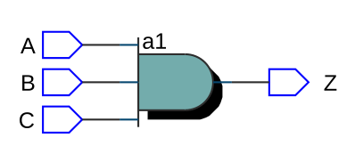
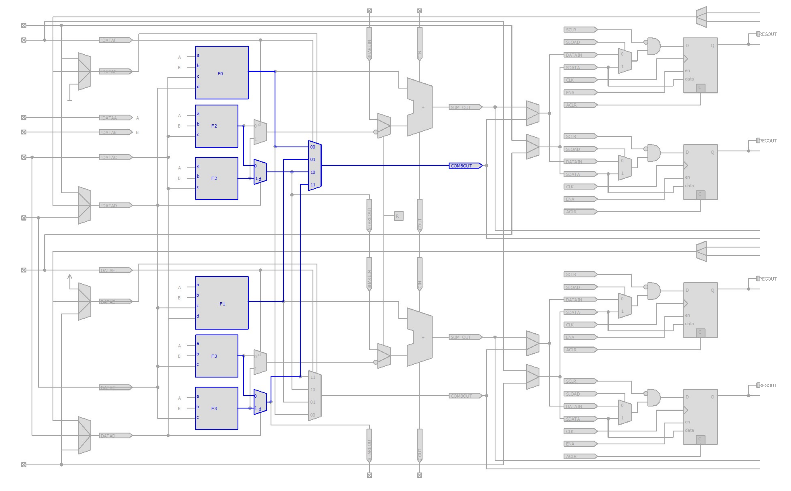
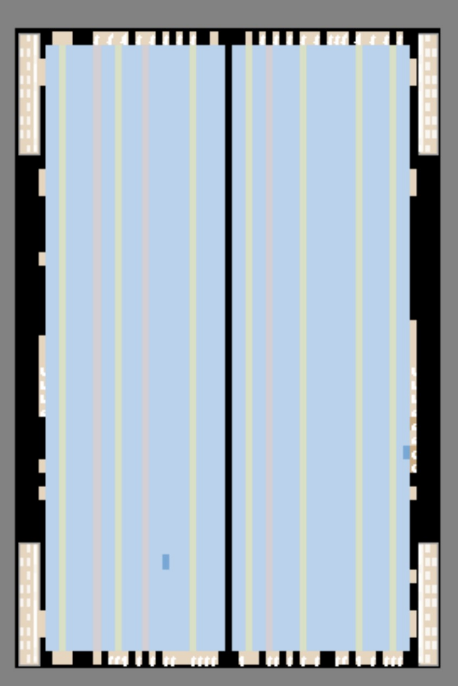
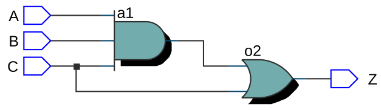
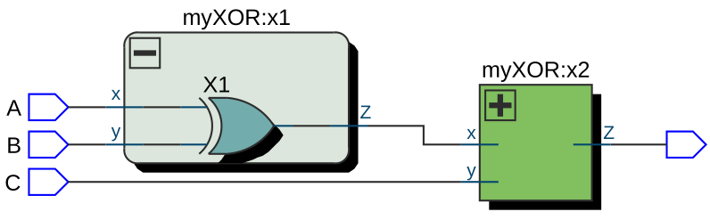
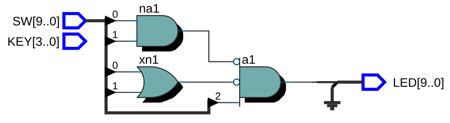

# Introduction

## What is FPGA?

Field programmable array. Not as efficient as electrionic design used in modern chips (ASIC), but very useful. Not cheap but easier to obtain in smaller quantity.  

- Can be used for tests.
- Used in millitary hardware because of security concerns.


## Binary Logic
Logic gates like `and`, `or` and `not` are the basic elements of circuit design.  

__Boolean function__: a function of logic operations that maps an input to an output. Forms like Sum of Products (SOM) can be used. Logic minimization can be done using _k-maps_ to implement simple circuis using fewer gates.

# Verilog

## Hierarchical Design
Circuits are too complex to be designed in a detailed fashion. Design must be approached in a top-down or bottom-up approach.

## HDL
A computer language for modeling behavior and structure of digital circuitry.

## Module Definition

Similar to functions in high-level languages.

```verilog
module example (a, b, c, y);
    input a;
    input b;
    input c;
    output y;

// here comes circuit description

endmodule
```

or  
```verilog
module example (input a,
                input b,
                input c,
                output y);

// here comes circuit description

endmodule
```

Variables can be arrays instead of bits:

```verilog
/* rest of code */
input   [31:0]  a; // a[31] .. a[0]
output  [15:8]  b1; // b1[15] .. b1[8]
output  [7:0]   b2; // b2[7], b[6] .. b2[0]
input       clk; // single signal
/* rest of code */
```

### Number Definitions
- number of bits
- representation (b,o,h)
- bits

e.g. Binary 3: `5'b101`

### Data Types
Nets connect components  
- `Wire` is main net type.  

Variables  store values between assignments.
- `Reg` is main variable type.

> Beware! Not all `Reg`s are defined as registers. The synthesizer decides how to treat the variable.


Logic values:  0, 1, x (undefined), z (tr-state, high-impedance)

### Verilog styles
Structural and behaviorial.

### Structural Verilog

```verilog
module top(A, SEL, C);
    input A;
    input SEL;
    output C;

/*some code*/ example(
    /* note the dot at the beginning of the variables
        denoting the "parameter" of the module */
    .a(A),
    /* and other inputs / ouputs */
)

endmodule

```

## Examples

The examples are implemented and "compiled" in Quartus using [5CEBA4F23C7](https://www.datasheets360.com/part/detail/5ceba4f23c7/347142369474300566/) during this course. To compile the design several steps are executed:

1. Analysis & Synthesis
   -  RTL viewer here shows a shematic of the circuit.
2. Fitter
   - Chip planner can be used to view how the module will be designed in the FPGA
3. Assembler
4. TimeQuest Timing Analysis
5. EDA Netlist Writer

### Example 1 - AND
|  |
| :---------------------------------------------------: |
|                   <b>RTL Viewer</b>                   |

|  |
| :--------------------------------------------------------------------------: |
|                   <b>Chip Planner Closer View</b>                   |

|  |
| :---------------------------------------------------: |
|                   <b>Chip Planner View</b>                   |

```verilog
module example_and(A, B, C, Z);
    input A, B, C;
    output Z;

    /* use an instance of the module and named `a1` */
    and a1(Z, A, B, C);
endmodule
```


### Example 2 - AND + OR

|  |
| :---------------------------------------------------: |
|                   <b>RTL Viewer</b>                   |

```verilog
/* Note that the size of the inputs have to be the same to use input before declaring them all (e.g. all 1-bit) */
module example_and_or(input A, B, C, output Z);
    /* wire is a variable of type `net` and has to be defined to use
        the output of a module in another (sequentially) */
    wire w1;

    and a1(w1, A, B, C);
    or o2(Z, w1, C);
endmodule
```

### Example 3 - Hierarchy

|  |
| :---------------------------------------------------: |
|                   <b>RTL Viewer</b>                   |

It becomes tedious to implement relatively complex designs in one module. Thus, multiple modules can be used.

```verilog
module example_hierarchy(input A, B, C, output Z);
    wire w1;

    myXOR x1(A, B, w1);
    myXOR x2(w1, C, Z);
endmodule

module myXOR(input x, y, output Z);
    xor X1(Z, x, y);
endmodule
```

### Example 4 - Bus

```verilog
module example_bus(input [9:0] SW,
                    output [9:0] LED);
    /* 10 cables of SW (each 1-bit)
        continous assignment (always assigned) */
    assign LED[9:0] = SW[9:0];
endmodule
```

> FPGAs are expensive. CPLD can be used which has more limited usage but is cheaper.

## Quartus
After creating a new project using `new project wizard` you can run your design on the FPGA by applying the following steps:

1. Start compilation
2. Assign the relevant pins to the variables using `Pin Planner`. (check out the manual of the board you are using)
3. Re-compile
4. Using programmer (setup hardware if necessary) choose the output file and press `start`

### Example 5 - Assigning constants 

```verilog
module example_constant(input [9:0] SW,
                        output [9:0] LED);
    /* assign 5 high bits */
    assign LED[9:5] = {5{1'b1}}; // replication
    /* assign 3 low and 2 high bits concatenated */
    assign LED[4:0] = {3'b000, 2'b11}; // concatination
endmodule
```

### Example 6 - "Named parameters"
```verilog
module example_named(input [9:0] in,
                    output [9:0] out);
    name name_instance(.a in[0], .b in[1], .c out[0]);
endmodule

module name(input a, b, output c);
    or o1(c, a, b);
endmodule
```

### Example 7 - Some boolean algebra
The following example implements the following boolean function `Q=(A.B)' . (A+B)' . C` where `Q` is `LED[0]`, `A` is `SW[0]`, `B` is `SW[1]` and `C` is `SW[2]`.

|  |
| :---------------------------------------------------: |
|                   <b>RTL Viewer</b>                   |

```verilog
module example_bool(input [9:0] SW,
                    output [9:0] LED);
    wire w1, w2;

    nand na1(w1, SW[0], SW[1]);
    nor no1(w2, SW[0], SW[1]);

    and a1(LED[0], w1, SW[2], W2);
endmodule
```