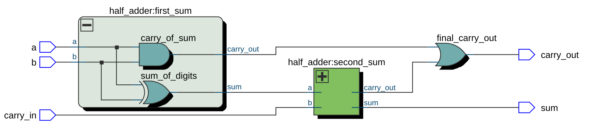
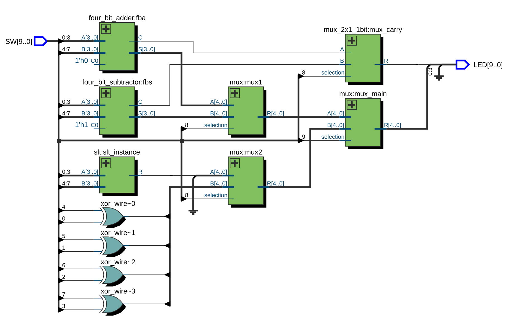

# Digital Design Primer

## Combinational Circuits
The ouput of the circuit depends only on the input at current time.  

Two steps to approach problems when designing circuits:
- Analysis
- Design: specifications, etc.

## Binary Adder
The half adder takes two bits and outputs sum (s) and carry (c).  The full adder on the other hand takes carry as input in addition to the two bits to be summed.

__Binary subtractor__ can be implemented by taking the two's complement of the number that will be subtracted.

> Comaprator, multipler have been reviewed.

# Designing an ALU (kinda)


## Half-adder
```verilog
module half_adder(output sum, carry_out, input a, b);
    xor sum_of_digits(sum, a, b);
    and carry_of_sum(carry_out, a, b);
endmodule
```

## Full-adder

|  |
| :-------------------------------------------------: |
|                  <b>RTL Viewer</b>                  |

```verilog
module full_adder(output sum, carry_out, input a, b, carry_in);
    wire sum_wire, first_carry_out, second_carry_out;

    half_adder first_sum(sum_wire, first_carry_out, a, b);
    half_adder second_sum(sum, second_carry_out, sum_wire, carry_in);

    or final_carry_out(carry_out, second_carry_out, first_carry_out);
endmodule
```

## 4-bit Adder
```verilog
module four_bit_adder(S, C, A, B, C0);
    input [3:0] A, B;
    input C0;
    output C;
    output [3:0] S;
    wire C1, C2, C3; // intermediate carries

    full_adder fa0(S[0], C1, A[0], B[0], C0),
                fa1(S[1], C2, A[1], B[1], C1),
                fa2(S[2], C3, A[2], B[2], C2),
                fa3(S[3], C, A[3], B[3], C3); 
endmodule
```

## 4-bit Subtractor
```verilog
module four_bit_subtractor(S, C, A, B, C0);
    input [3:0] A, B;
    input C0;
    output C;
    output [3:0] S;
    wire C1, C2, C3; // intermediate carries
    wire [3:0] B_inverted;

    // data-flow (not hierarchy)
    assign B_inverted[3:0] = ~B[3:0];

    full_adder fa0(S[0], C1, A[0], B_inverted[0], C0),
                fa1(S[1], C2, A[1], B_inverted[1], C1),
                fa2(S[2], C3, A[2], B_inverted[2], C2),
                fa3(S[3], C, A[3], B_inverted[3], C3); 
endmodule
```

## SLT (Set Less Than)
```verilog
module slt(output R, input [3:0] A, B);
    // sets R to 1 if A < B
    wire [3:0] res;
    wire c;

    // A - B
    four_bit_subtractor sub(res[3:0], c, A[3:0], B[3:0], 1'b1);

    assign R = res[3];
endmodule
```

## 4-bit XOR
```verilog
module four_bit_xor(output [3:0] R, input [3:0] A, B);
    // can be written as:
    // assign R = A^B
    xor x0(R[0], A[0], B[0]),
        x1(R[1], A[1], B[1]),
        x2(R[2], A[2], B[2]),
        x3(R[3], A[3], B[3]);
endmodule
```

## Multiplexer
```verilog
module mux(output [4:0] R, input [4:0] A, B, input selection);
	mux_2x1_1bit mx0(R[0], A[0], B[0], selection),
					mx1(R[1], A[1], B[1], selection),
					mx2(R[2], A[2], B[2], selection),
					mx3(R[3], A[3], B[3], selection);
endmodule

module mux_2x1_1bit(output R, input A, B, selection);
	wire and1, and2;
	
	and a1(and1, A, ~selection),
		a2(and2, B, selection);
	
	or o1(R, and1, and2);
endmodule
```

## Bringing it all together

|  |
| :----------------------------------------: |
|             <b>RTL Viewer</b>              |

`SW` represents an array of switches and `LED` represents an array of LEDs that we used as I/O on the board after configuring the pins of the FPGA.

```verilog
module alu(input [9:0] SW, output [9:0] LED);
	wire [3:0] add_wire, sub_wire, slt_wire, xor_wire;
	wire [3:0] mux0_out, mux1_out;
	wire c_sub, c_add;
	
	four_bit_adder fba(add_wire[3:0], c_add, SW[3:0], SW[7:4], 1'b0);
	four_bit_subtractor fbs(sub_wire[3:0], c_sub, SW[3:0], SW[7:4], 1'b1);
	slt slt_instance(slt_wire[0], SW[3:0], SW[7:4]);
	assign xor_wire[3:0] = SW[3:0] ^ SW[7:4];
	
    // 4x1 multiplexer using 3 2x1 multiplexers
	mux mux1(mux0_out[3:0], add_wire[3:0], sub_wire[3:0], SW[8]);
	mux mux2(mux1_out[3:0], slt_wire[3:0], xor_wire[3:0], SW[8]);
	
	mux mux_main(LED[3:0], mux0_out[3:0], mux1_out[3:0], SW[9]);
	
	// handle carry of adder and subtractor
	mux_2x1_1bit mux_carry(LED[4], c_add, c_sub, SW[8]);
endmodule
```

> Note that more effiecient and prettier code can be used to generate an "ALU" with the same functionality. The objective is to use primitives and hierarchical reference for educational purposes.