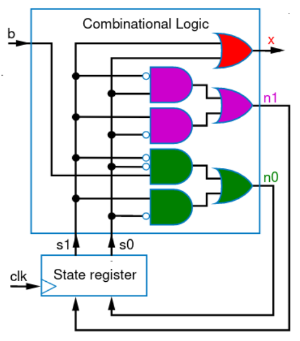

# Finite State Machine

## Sequential circuits
Need the previous state in addition to the current one. (recall Flip-flops)

## Finite State Machine
Some sequential circuits with particular behavior over time can emulate a FSM. FSM describes the desired behavior of sequential circuit with states and transitions.


### Example 1 - Pattern
Design an FSM that lights during button push and for three seconds after that.

> __Copyright Notice__: Figures below are copyrighted materials and are under the terms of the related source.

|  |
| :--------------------------------------------------------------: |
|      <b>The FSM Diagram </b> _(Source: Frank Vahid, 2006)_       |

A register can be used to hold the state, boolean algebra can be used afterwards to find transition equations.

|   |
| :------------------------------------------------------: |
| <b>The Circuit Diagram</b> _(Source: Frank Vahid, 2006)_ |

### Example 2 - MUX
_(Source: Capkun and Gürkaynak, 2014)_

```verilog
module mux2(output [3:0] Y,
            input [3:0] A, B,
            input S);

    assign Y = S ? B : A;
endmodule
```

### Example 3 - D Flip-Flop
_(Source: Capkun and Gürkaynak, 2014)_

```verilog
module flop(input clk,
            input [3:0] d,
            output reg [3:0] q);
    // posedge means positive edge (rising edge)
    always @ (posedge clk)
        q <= d; // pronounced “q gets d”
endmodule
```

With async reset:
```verilog
module flop_ar (input clk,
                input reset,
                input [3:0] d,
                output reg [3:0] q);

    // triggered on rising edge or a falling edge on reset
    always @ (posedge clk, negedge reset)
        begin
            if (reset == '0') q <= 0; // when reset
            else q <= d; // when clk
        end
endmodule
```

### Example 4 - 7-segment
_(Source: Capkun and Gürkaynak, 2014)_

```verilog
module sevensegment (input [3:0] data,
                    output reg [6:0] segments);

    // triggered on any change in the module's input variables
    always @ ( * ) // * is short for all signals
        case (data) // case statement
            0: segments = 7'b111_1110; // when data is 0
            1: segments = 7'b011_0000; // when data is 1
            2: segments = 7'b110_1101;
            3: segments = 7'b111_1001;
            4: segments = 7'b011_0011;
            5: segments = 7'b101_1011;
            // etc etc
            default: segments = 7'b000_0000; // required
        endcase
endmodule
```

> Not adding a `default` case lead to latch inferring! (Which means making the circuit sequential instead of combinational)

## Blocking and Non-blocking Assignment
_(Source: Capkun and Gürkaynak, 2014)_

```verilog
// non-blocking
always @ (a)
begin
    a <= 2’b01;
    b <= a;
// all assignments are made here
// b is not (yet) 2'b01
end
```

```verilog
always @ (a)
begin
    a = 2'b01;
// a is 2'b01
    b = a;
// b is now 2'b01 as well
end
```

> Beware! Blocking assignments may not be synthesized to apply the operations in order if the same variable is used (e.g. `sum = 2 * x; x = sum + y;` can be reversed). You should pay attention to the variables you use.

### Example 5 - D FF with enable and reset
```verilog
module d_ff(input clk, enable, reset_n,
            input [4:0] d,
            output reg [4:0] q);

    always @(posedge clk, nedge reset_n)
        begin
// note that the buttons we use are low when pressed. Hence negative edge is used as trigger.
            if (!reset_n) q <= 5'b0;
            else
                begin
                    if (enable) q <= d;
                end
        end
endmodule
```

### Example 6 - A pattern generator
Implement a design that shows the pattern `0001, 0011, 1100, 1000` in a sequential order. Here `HEX0` through `HEX5` are connected to the pins of common anode LEDs and `clk` is the clock signal.

> Assign can be used with `wire`, `output` (of net type) not with `reg`.

```verilog
module pattern(input clk,
                output [6:0] HEX0, HEX1, HEX2, HEX3, HEX4, HEX5);
    reg [1:0] state;
    wire [23:0] num_out;

    always @(posedge clk)
        begin
            state[1] <= state[1] ^ state[0];
            state[0] <= ~state[0]
        end
    
    assign num_out[0] = ~state[1];
    assign num_out[4] = ~state[1] & state[0];
    assign num_out[8] = state[1] & ~state[0];
    assign num_out[12] = state[1];

SEG7_LUT_6 seglut(HEX0, HEX1, HEX2, HEX3, HEX4, HEX5, num_out[23:0]);

endmodule
```

`SEG7_LUT_6` outputs a hexadecimal 24-bit number to 6 7-segment displays, the module is provided by the manufacturer of the board [terasIC](https://www.terasic.com) as below:

```verilog
module SEG7_LUT_6 (	oSEG0,oSEG1,oSEG2,oSEG3,oSEG4,oSEG5,iDIG );
input	[23:0]	iDIG;
output	[6:0]	oSEG0,oSEG1,oSEG2,oSEG3,oSEG4,oSEG5;

SEG7_LUT	u0	(	oSEG0,iDIG[3:0]		);
SEG7_LUT	u1	(	oSEG1,iDIG[7:4]		);
SEG7_LUT	u2	(	oSEG2,iDIG[11:8]	);
SEG7_LUT	u3	(	oSEG3,iDIG[15:12]	);
SEG7_LUT	u4	(	oSEG4,iDIG[19:16]	);
SEG7_LUT	u5	(	oSEG5,iDIG[23:20]	);
endmodule

module SEG7_LUT	(	oSEG,iDIG	);
input	[3:0]	iDIG;
output	[6:0]	oSEG;
reg		[6:0]	oSEG;

always @(iDIG)
begin
		case(iDIG)
		4'h1: oSEG = 7'b1111001;	// ---t----
		4'h2: oSEG = 7'b0100100; 	// |	  |
		4'h3: oSEG = 7'b0110000; 	// lt	 rt
		4'h4: oSEG = 7'b0011001; 	// |	  |
		4'h5: oSEG = 7'b0010010; 	// ---m----
		4'h6: oSEG = 7'b0000010; 	// |	  |
		4'h7: oSEG = 7'b1111000; 	// lb	 rb
		4'h8: oSEG = 7'b0000000; 	// |	  |
		4'h9: oSEG = 7'b0011000; 	// ---b----
		4'ha: oSEG = 7'b0001000;
		4'hb: oSEG = 7'b0000011;
		4'hc: oSEG = 7'b1000110;
		4'hd: oSEG = 7'b0100001;
		4'he: oSEG = 7'b0000110;
		4'hf: oSEG = 7'b0001110;
		4'h0: oSEG = 7'b1000000;
		endcase
end
endmodule
```

|   |
| :------------------------------------------------------: |
| <b>The Circuit Diagram</b> _(Source: Frank Vahid, 2006)_ |


### Example 7 - Odd number counter
Design a 4-bit odd number counter.
```verilog
module pattern(input clk,
                output [6:0] HEX0, HEX1, HEX2, HEX3, HEX4, HEX5);
    reg [2:0] state;
    wire [23:0] num_out;
    
    always@(posedge clk)
		begin
			state[0] <= ~state[0];
			state[1] <= (state[0] ^ state[1]) & ~state[2];
			state[2] <= (state[1] & state[0]) + (state[2] & ~state[0]);
		end
	
	always @(*)
		case(state)
			3'd0: num_out[3:0] = 4'd2;
			3'd1: num_out[3:0] = 4'd3;
			3'd2: num_out[3:0] = 4'd5;
			3'd3: num_out[3:0] = 4'd7;
			3'd4: num_out[3:0] = 4'd11;
			3'd5: num_out[3:0] = 4'd13;
			default: num_out[3:0] = 4'd0;
		endcase

SEG7_LUT_6 seglut(HEX0, HEX1, HEX2, HEX3, HEX4, HEX5, num_out[23:0]);

endmodule
```