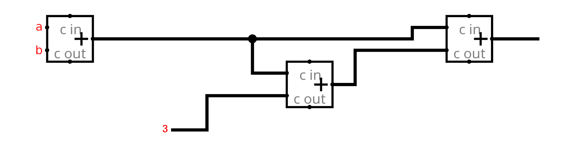
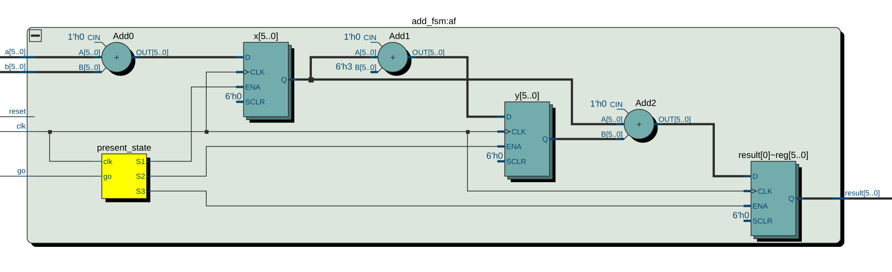

# Verilog
## C to FPGA


### Example 1 - (x+y) * 2 + 3
```C
#include <stdio.h>

// Functions here will be translated to modules
int add(int a, int b) {
    int x = a + b;
    int y = 3 + x;
    return x+y;
}

// The main function will be used as a test bench
int main() {
    int a, b, c;

    a = 2;
    b = 5;
    c = add(a, b);
    return 0;
}
```


|  |
| :----------------------------------------------------: |
|      <b>The Circuit Diagram with Three Adders</b>      |

> While the design above works fine with three adders this is not a good design as ALU units are expensive.

#### Verilog Implementation

```verilog
module add_fsm(
	input go,
	input [5:0] a, b,
	input reset,
	input clk,
	output reg [5:0] result);

	reg [5:0] x, y;
	
	localparam S0 = 2'd0,
					S1 = 2'd1,
					S2 = 2'd2,
					S3 = 2'd3;
					
	reg [1:0] present_state;
	
	always @(posedge clk)
		case (present_state)
	
		S0:
			begin
			if(go)
				present_state <= S1;
			end
			
		S1:
			begin
				x <= a + b;
				present_state <= S2;
			end
			
		S2:
			begin
				y <= x + 6'd3;
				present_state <= S3;
			end
			
		S3:
			begin
				result <= x + y;
				present_state <= S0;
			end
		
		default:
			present_state <= 2'd0;

		endcase
		
endmodule
```

Here is a visualization of the synthesized design:
|  |
| :-------------------------------------------------------------------: |
|                           <b>RTL Viewer</b>                           |


#### Test Bench
We can write the following code to verify that the design will output 17 for `a=2` and `b=5`.

```verilog
module add_tb();

	reg [5:0] a;
	reg [5:0] b;
	reg go, reset, clk;
	wire [5:0] result;

	add_fsm fsm(.go(go), .a(a), .b(b), .reset(reset), .clk(clk), .result(result));


	initial
		begin
	
			a <= 6'd0;
			b <= 6'd0;
			go <= 1'd0;
			reset <= 1'd1;
			clk <= 1'd0;
			
			#2
			reset <= 1'd0;
			
			#5
			a <= 6'd2;
			b <= 6'd5;
			go <= 1'd1;
			
			#5
			go <= 1'd0;
		
		end
	
	always
		begin
			#1
			clk <= ~clk;
		end
	
	always
		begin
			#3
			// to show the values in the simulation
			$display("result: %p\n", result);
			$display("x: %p\n", fsm.x);
		end

endmodule
```

To simulate the design ModelSim path must be added in Quartus from `tools - options - EDA tool options`.

I got the following output in the simulation terminal after compiling the design above.

```
# result: x
# 
# x: x
# 
# result: x
# 
# x: x
# 
# result: x
# 
# x: x
# 
# result: x
# 
# x: 7
# 
# result: 17
```

### Example 2 - Test XOR

Here is another test bench example for the 4-bit xor module we've written [before](02%20-%20digital%20design.md#4-bit-xor).

```verilog
module xor_tb();

	reg [3:0] a, b;
	wire [3:0] result;
	
	four_bit_xor fx(result[3:0], a[3:0], b[3:0]);
	
	initial
		begin
			a = 4'h0; b = 4'hf;
			#10; // 10 clock cycle delay
			a = 4'b0101; b = 4'b1111;
			#10;
			a = 4'hf; b = 4'hf;
			#10;
		end
		
	initial
		begin
			// monitor prints something only when one of the variables change.
			$monitor("time =%2d, a = %b, b = %b, result = %b",
			$time, a, b, result);
		end

endmodule
```

The output of the simulation is:
```
# time = 0, a = 0000, b = 1111, result = 1111
# time =10, a = 0101, b = 1111, result = 1010
# time =20, a = 1111, b = 1111, result = 0000
```

### Example 3 - ALU Test
Here we test the functionality of the ALU module we wrote [before](02%20-%20digital%20design.md#bringing-it-all-together).
```verilog
module alu_tb();
	reg [3:0] a, b;
	reg [1:0] s;
	
	wire [3:0] result;
// added to fill in the unused LEDs in the port of the module `alu`.
	wire [4:0] temp_result;
	wire c_out;
	
	alu alu_instance({s[1:0], b[3:0], a[3:0]}, {temp_result[4:0], c_out, result[3:0]});
	
	initial
		begin
			a = 4'h6; b = 4'h2; s = 00;
			#10;
			a = 4'b1010; b = 4'b0101; s = 01;
			#10;
			a = 4'h2; b = 4'h4; s = 10;
			#10;
			a = 4'h2; b = 4'h4; s = 11;
			#10;
		end
	
	initial
		begin
			$monitor("time =%2d, s =%2b, a = %b, b = %b, result = %b",
			$time, s, a, b, result);
		end
endmodule
```

## Cycles vs Cost: To duplicate or not to duplicate
Using multiple instances of the gate as in the design [above](#example-1---xy--2--3) allows for fast operations in one cycle, but has the cost of adding more gates which is costly. Especially when using costly hardware blocks we try not to duplicate the block and instead accept input from a data path where the value of the signals on the data path are chosen by a [control unit](https://en.wikipedia.org/wiki/Control_unit). This comes at the expence of adding memory elements to the design to keep the value of the variables to be used in a later clock cycle.

