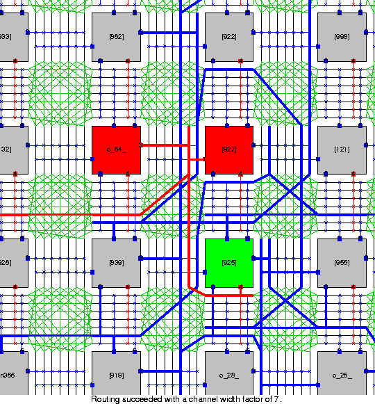

# From C to FPGA
Lookup Tables are implemented with muxes to choose an option from several inputs. FPGA Routing allows for mapping between logic blocks.

|                          |
| :----------------------------------------------------------------------------------------------------------: |
| <b> [Close-up View](https://www.eecg.utoronto.ca/~vaughn/vpr/e64.html) of the FPGA Routing Architecture </b> |


> We will be using floating point numbers represented in [IEEE-754 standard](https://en.wikipedia.org/wiki/IEEE_754). To do arithmetic operations we need floating point adders, multipliers, etc. Those will be provided as [IP core](https://en.wikipedia.org/wiki/Semiconductor_intellectual_property_core).


## Polinom Computer
Our design here computes a polinom with 4 terms.
```C
/*
* Function: computePol
* --------------------
* Returns the result of a polinom with 4 terms of coeffiecents `coeff`
* and degrees `degree`.
*/
float computePol(float *coeff, int *degree, float x) {
    //---IDLE---
    float FRmult    = 1;
    float FRsum     = 0;
    int IRdegree    = degree[0];
    int FRcoeff     = coeff[0];
    int i           = 0;

    while (i < 4) {
        // TO BE FILLED
    }
}

```
> Schematics of the finite state machine will be added here.

The design above is written in Verilog in the following 4 sections. The implementation is written by [Alp A. Bayrakci](https://bilmuh.gtu.edu.tr/~bayrakci/). Please cite him as follows:
```
GTU Integrated Circuits Laboratory
https://icl.gtu.edu.tr
The module that combines control unit and datapath
for polynomial computation
August 2022
Alp A. Bayrakci
```

### Datapath
```verilog
module polDatapath(
	input		[127:0] FP_Arr_Coeff_unpacked,
	input		[31:0] INT_Arr_Degree_unpacked,
	input		[31:0] FP_X,
	input sel_cnt,	
	input sel_cnt2,
	input sel_degree2,
	input sel_mult,
	input sel_sum,
	input sel_xcoeff,
	input en_cnt,
	input en_cnt2,
	input en_x,
	input en_degree,
	input en_coeff,
	input en_mult,
	input en_sum,
	input CLK,
	output degree_zero,
	output counter_zero,
	output counter2_end,
	output	[31:0] Sum	//Pol Result
);

//Registers FR for Floating Point, IR for Integer
reg [3:0] IRcounter;		//to wait ip core results
reg [2:0] IRcounter2;	//to change coeffs and degrees
reg [31:0] FRx;
reg [7:0] IRdegree;
reg [31:0] FRcoeff;
reg [31:0] FRmult;
reg [31:0] FRsum;

//Interconnects
reg [7:0] INT_In_Degree1;
reg [7:0] INT_In_Degree2;
wire [7:0] INT_Sub_Result;
wire [3:0] INT_Sub_Result2;
wire [2:0] INT_Sub_Result3;
reg [3:0] INT_In_Cnt;
reg [2:0] INT_In_Cnt2;

//reg [31:0] FP_In_X;
reg [31:0] FP_In_Coeff;
reg [31:0] FP_In_Mult;
reg [31:0] FP_In_Sum;
wire [31:0] FP_Mult_Result;
wire [31:0] FP_Sum_Result;
reg [31:0] FP_In_Mult2;


//Define wires to organize inputs
wire [31:0] FP_Arr_Coeff [3:0];
wire [7:0] INT_Arr_Degree [3:0];

//select wires for degree and coeff
wire [1:0] sel_coeff;
wire [1:0] sel_degree1;

//Organize the 2d array inputs
assign {FP_Arr_Coeff[3], FP_Arr_Coeff[2], FP_Arr_Coeff[1], FP_Arr_Coeff[0]} = FP_Arr_Coeff_unpacked;
assign {INT_Arr_Degree[3], INT_Arr_Degree[2], INT_Arr_Degree[1], INT_Arr_Degree[0]} = INT_Arr_Degree_unpacked;

//Assignments
assign Sum = FRsum;
assign degree_zero = (IRdegree == 8'd0);
assign counter_zero = (IRcounter == 4'd0);
assign counter2_end = (IRcounter2 == 3'd3);

//Assign coeff and degree selects
assign sel_coeff 		= IRcounter2[1:0];
assign sel_degree1 	= IRcounter2[1:0];

//Put down Degree and Counter Decrement Logic
assign INT_Sub_Result = IRdegree - 8'd1;
assign INT_Sub_Result2 = IRcounter - 4'd1;
assign INT_Sub_Result3 = IRcounter2 + 3'd1;

//Put down FP Adder
ip_fp_add g_adder(
	.clock(CLK),
	.dataa(FRsum),
	.datab(FRmult),
	.result(FP_Sum_Result));

//Put down FP Multiplier
ip_fp_mult g_mult(
	.clock(CLK),
	.dataa(FRmult),
	.datab(FP_In_Mult2),
	.result(FP_Mult_Result));	
	

//Put down registers to datapath
always @(posedge CLK)
	begin
	if(en_x)
		FRx 		<= FP_X;
	if(en_degree)
		IRdegree <= INT_In_Degree2;
	if(en_coeff)
		FRcoeff 	<= FP_In_Coeff;	
	if(en_mult)
		FRmult 	<= FP_In_Mult;	
	if(en_sum)
		FRsum 	<= FP_In_Sum;
	if(en_cnt)
		IRcounter<= INT_In_Cnt;
	if(en_cnt2)
		IRcounter2<= INT_In_Cnt2;
	end


//Put down MUXes to datapath
always @(*)
	begin	
	//IP counter MUX
	case(sel_cnt)
		1'b0: INT_In_Cnt = 4'd8;	//Wait for 8 cycles
		1'b1: INT_In_Cnt = INT_Sub_Result2;	
	endcase
	
	//Coeff-Degree counter MUX
	case(sel_cnt2)
		1'b0: INT_In_Cnt2 = 3'd0;	//Corresponds to 1 in single precision floating point
		1'b1: INT_In_Cnt2 = INT_Sub_Result3;	
	endcase
	
	//Coeff MUX
	case(sel_coeff)
		2'b00: FP_In_Coeff = FP_Arr_Coeff[0];
		2'b01: FP_In_Coeff = FP_Arr_Coeff[1];
		2'b10: FP_In_Coeff = FP_Arr_Coeff[2];
		2'b11: FP_In_Coeff = FP_Arr_Coeff[3];	
	endcase
	
	//Mult MUX
	case(sel_mult)
		1'b0: FP_In_Mult = 32'h3f800000;	//Corresponds to 1 in single precision floating point
		1'b1: FP_In_Mult = FP_Mult_Result;	
	endcase
	
	//Sum MUX
	case(sel_sum)
		1'b0: FP_In_Sum = 32'h00000000;	//Corresponds to 0 in single precision floating point
		1'b1: FP_In_Sum = FP_Sum_Result;	
	endcase
	
	//x-Coeff MUX
	case(sel_xcoeff)
		1'b0: FP_In_Mult2 = FRx;
		1'b1: FP_In_Mult2 = FRcoeff;	
	endcase
	
	//Degree MUX-1
	case(sel_degree1)
		2'b00: INT_In_Degree1 = INT_Arr_Degree[0];
		2'b01: INT_In_Degree1 = INT_Arr_Degree[1];
		2'b10: INT_In_Degree1 = INT_Arr_Degree[2];
		2'b11: INT_In_Degree1 = INT_Arr_Degree[3];	
	endcase
	
	//Degree MUX-2
	case(sel_degree2)
		1'b0: INT_In_Degree2 = INT_In_Degree1;
		1'b1: INT_In_Degree2 = INT_Sub_Result;
	endcase
	
	
	end

endmodule
```

### Control Unit
```verilog
module polControl(
	output reg sel_cnt,
	output reg sel_cnt2,
	output reg sel_degree2,
	output reg sel_mult,
	output reg sel_sum,
	output reg sel_xcoeff,
	
	output reg en_cnt,
	output reg en_cnt2,
	output reg en_x,
	output reg en_degree,
	output reg en_coeff,
	output reg en_mult,
	output reg en_sum,
	
	output reg done,
	
	input reset,
	input CLK,
	input degree_zero,
	input counter_zero,
	input counter2_end,
	input go
);


//State Naming
localparam 	IDLE			= 4'd0,
				WAIT8_1		= 4'd1,				
				COMPDEGREE	= 4'd2,						
				MULTPREP		= 4'd3,	
				WAIT8_2		= 4'd4,
				SUMPREP		= 4'd5,
				WAIT8_3		= 4'd6,
				NEXTONE		= 4'd7,						
				RESTART		= 4'd8,						
				END			= 4'd9;	
				
				

reg [3:0] curr_state;
reg [3:0] next_state = IDLE;


//state register 
always@(posedge CLK)
	begin
	if(reset) 	curr_state <= IDLE;
	else 			curr_state <= next_state;		
	end

//next state logic
always@(*)
	begin
	next_state = curr_state; //If you delete this you get big problem (Undefined state entrance)
	
	case(curr_state)
		
		IDLE: 
				begin
				if(go) next_state = WAIT8_1;
				end 
		
		WAIT8_1:		//Wait for (FRmult * x) multiplication 
				begin
				if(degree_zero) 			next_state = MULTPREP;
				else if(counter_zero) 	next_state = COMPDEGREE;
				end 
		 
		COMPDEGREE: //Continue on (FRmult * x) multiplication until degree is 0
				begin
				next_state = WAIT8_1;
				end 
				 
		MULTPREP: 	//Prepare for (FRcoeff * FRmult)
				begin
				next_state = WAIT8_2;
				end
				
		WAIT8_2:		//Wait for (FRmult * x) multiplication 
				begin
				if(counter_zero) next_state = SUMPREP;
				end 		
			
		SUMPREP: 	//Prepare for (FRsum + FRmult) addition
				begin
				next_state = WAIT8_3;
				end				
				
		WAIT8_3:		//Wait for (FRmult * x) multiplication 
				begin
				if(counter_zero) next_state = NEXTONE;
				end
		
		NEXTONE: 	//If all terms are computed the polynomial computation has finished
						//otherwise increase the coeff-degree counter and go back for the next polynomial term
				begin
				if(counter2_end) 	next_state = END;
				else 					next_state = RESTART;
				end
				
		RESTART:		//Restore all register contents other than Sum and coeff-degree counter for next round
				begin
				next_state = WAIT8_1;
				end
				 
		END:
				begin
				end
		
		
	endcase
	end

	
//output logic
always@(*)
	begin
	sel_cnt		= 1'b0;
	sel_cnt2 	= 1'b0;
	sel_degree2 = 1'b0;
	sel_mult 	= 1'b0;
	sel_sum 		= 1'b0;
	sel_xcoeff 	= 1'b0;
	en_cnt 		= 1'b0;
	en_cnt2		= 1'b0;
	en_x 			= 1'b0;
	en_degree	= 1'b0;
	en_coeff 	= 1'b0;
	en_mult 		= 1'b0;
	en_sum 		= 1'b0;
	done			= 1'b0;
	
	case(curr_state)
			
		IDLE: 
				begin
				en_cnt 		= 1'b1;
				en_cnt2		= 1'b1;
				en_x 			= 1'b1;
				en_degree	= 1'b1;
				en_coeff 	= 1'b1;
				en_mult 		= 1'b1;
				en_sum 		= 1'b1;
				end
		
		WAIT8_1: 
				begin
				
				sel_mult 	= 1'b1;
				//Wait for 8 cycles
				sel_cnt  	= 1'b1;
				en_cnt 		= 1'b1;
				end
				
		COMPDEGREE: 
				begin 
				
				//perform FRdegree - 1
				sel_degree2 = 1'b1;
				en_degree 	= 1'b1;
				
				//perform FRmult * x for degree times
				sel_mult 	= 1'b1;
				en_mult 		= 1'b1;		
				
				//Restore counter
				en_cnt  		= 1'b1;
				end			
		
		
		MULTPREP: 
				begin
				//Prepare coefficient multiplication
				sel_xcoeff 	= 1'b1;
				sel_mult 	= 1'b1;
				end
				
		WAIT8_2: 
				begin	
				sel_xcoeff 	= 1'b1;
				sel_mult 	= 1'b1;
				
				//Wait for 8 cycles
				sel_cnt  	= 1'b1;
				en_cnt 		= 1'b1;
				end
					
		SUMPREP:
				begin
				//Restore counter
				en_cnt  		= 1'b1;
				
				//Write the result to Mult register
				sel_mult 	= 1'b1;
				en_mult 		= 1'b1;
				
				sel_sum 		= 1'b1;		//Sum will be accumulated
				end
				
		WAIT8_3: 
				begin		
				sel_sum 	= 1'b1;
				
				//Wait for 8 cycles
				sel_cnt  = 1'b1;
				en_cnt 	= 1'b1;
				end
				
		NEXTONE:  
				begin
				sel_sum 	= 1'b1;
				en_sum 	= 1'b1;		//Write the sum result
				
				//Count +1 for next coeff and degree
				en_cnt2 	= 1'b1;
				sel_cnt2 = 1'b1;
				end
				
				 
		RESTART:
				begin								
				//Restore registers other than Sum register and counter 2
				en_cnt 		= 1'b1;
				en_x 			= 1'b1;
				en_degree	= 1'b1;		//Take next degree
				en_coeff 	= 1'b1;
				en_mult 		= 1'b1;			
				end
				
		END:
				begin
				done 			= 1'b1; 			//Poly computation has finisihed
				end
				 
		
	endcase
	end
	
endmodule
```

### Link Them Together
```verilog
module computePol(
	input		[127:0] FP_Arr_Coeff_unpacked,
	input		[31:0] INT_Arr_Degree_unpacked,
	input		[31:0] FP_X,
	input go,
	input reset,
	input CLK, 
	output [31:0] Result,
	output done
);


wire sel_cnt;
wire sel_cnt2;
wire sel_degree2;
wire sel_mult;
wire sel_sum;
wire sel_xcoeff;
wire en_cnt;
wire en_cnt2;
wire en_x;
wire en_degree;
wire en_coeff;
wire en_mult;
wire en_sum;

wire degree_zero;
wire counter_zero;
wire counter2_end;

polControl gC(
	.sel_cnt(sel_cnt),	
	.sel_cnt2(sel_cnt2),
	.sel_degree2(sel_degree2),
	.sel_mult(sel_mult),
	.sel_sum(sel_sum),
	.sel_xcoeff(sel_xcoeff),
	.en_cnt(en_cnt),
	.en_cnt2(en_cnt2),
	.en_x(en_x),
	.en_degree(en_degree),
	.en_coeff(en_coeff),
	.en_mult(en_mult),
	.en_sum(en_sum),
	.done(done),
	
	.reset(reset),
	.CLK(CLK),
	.degree_zero(degree_zero),
	.counter_zero(counter_zero),
	.counter2_end(counter2_end),
	.go(go)
);

polDatapath gDP(
	.FP_Arr_Coeff_unpacked(FP_Arr_Coeff_unpacked),
	.INT_Arr_Degree_unpacked(INT_Arr_Degree_unpacked),
	.FP_X(FP_X),
	.sel_cnt(sel_cnt),	
	.sel_cnt2(sel_cnt2),
	.sel_degree2(sel_degree2),
	.sel_mult(sel_mult),
	.sel_sum(sel_sum),
	.sel_xcoeff(sel_xcoeff),
	.en_cnt(en_cnt),
	.en_cnt2(en_cnt2),
	.en_x(en_x),
	.en_degree(en_degree),
	.en_coeff(en_coeff),
	.en_mult(en_mult),
	.en_sum(en_sum),
	.CLK(CLK),
	.degree_zero(degree_zero),
	.counter_zero(counter_zero),
	.counter2_end(counter2_end),
	.Sum(Result)	//Pol Result
);


endmodule
```

### Test Bench
```verilog
`timescale 1 ps / 1 ps
module fp_tb();

reg [31:0] Coeff [3:0];
reg [7:0] Degree [3:0];
reg [31:0] X;
reg go;
reg reset;
reg [127:0] FP_Arr_Coeff_unpacked;
reg [31:0] INT_Arr_Degree_unpacked;

reg CLK = 1'b0;
wire [31:0] R;
wire done;


computePol2 gCP(
	.FP_Arr_Coeff_unpacked(FP_Arr_Coeff_unpacked),
	.INT_Arr_Degree_unpacked(INT_Arr_Degree_unpacked),
	.FP_X(X),
	.go(go),
	.reset(reset),
	.CLK(CLK), 
	.Result(R),
	.done(done)
);

always 
	begin
	#1
	CLK = ~CLK;
	end

initial
	begin
	
	reset = 1'b1;
	go = 1'b0;
	
		
	Coeff[3] = 0;
	Coeff[2] = 0;
	Coeff[1] = 32'h40800000;
	Coeff[0] = 32'h40000000;

	Degree[3] = 0;
	Degree[2] = 0;
	Degree[1] = 0;
	Degree[0] = 2;
	
	FP_Arr_Coeff_unpacked = {Coeff[3], Coeff[2], Coeff[1], Coeff[0]};
	INT_Arr_Degree_unpacked = {Degree[3], Degree[2], Degree[1], Degree[0]};
	
	X = 32'h40a00000;//5
	
	#8
	reset = 1'b0;
	#5
	go = 1'b1;
	
	#850
	reset = 1'b1;
	go = 1'b0;
	
		
	Coeff[3] = 32'h40a00000;//5
	Coeff[2] = 32'h41300000;//11
	Coeff[1] = 32'h40e00000;//7
	Coeff[0] = 32'h40a00000;//5

	Degree[3] = 4;
	Degree[2] = 0;
	Degree[1] = 1;
	Degree[0] = 3;
	
	FP_Arr_Coeff_unpacked = {Coeff[3], Coeff[2], Coeff[1], Coeff[0]};
	INT_Arr_Degree_unpacked = {Degree[3], Degree[2], Degree[1], Degree[0]};
	
	X = 32'h40400000;//3
	
	#8
	reset = 1'b0;
	#5
	go = 1'b1;
	
	#850
	reset = 1'b1;
	go = 1'b0;
	
		
	Coeff[3] = 32'hc0e00000;//-7
	Coeff[2] = 32'hc1300000;//-11
	Coeff[1] = 32'h40e00000;//7
	Coeff[0] = 32'h40a00000;//5

	Degree[3] = 2;
	Degree[2] = 0;
	Degree[1] = 1;
	Degree[0] = 3;
	
	FP_Arr_Coeff_unpacked = {Coeff[3], Coeff[2], Coeff[1], Coeff[0]};
	INT_Arr_Degree_unpacked = {Degree[3], Degree[2], Degree[1], Degree[0]};
	
	X = 32'hc0400000;//3
	
	#8
	reset = 1'b0;
	#5
	go = 1'b1;
	
	
	end


endmodule
```

### Simulation
To simulate link the `lpm_ver` library as follows:
```
vsim -L lpm_ver work.fp_tb
```

> Do not forget to add the relevant IP core modules in order allow [ModelSim](https://www.intel.com.tr/content/www/tr/tr/software/programmable/quartus-prime/model-sim.html) to simulate the hardware correctly.